# 🎬 SidbanCinema

> **SidbanCinema is a full-stack movie streaming portfolio application built with React, Spring Boot, MongoDB, Docker, and TMDB API.**


---

## 📖 About

SidbanCinema is a full-stack movie streaming platform developed as a **portfolio project** to demonstrate enterprise-level web application development.

The project focuses on building a secure, scalable, and modern streaming platform with clean architecture, JWT authentication, AI integration, and responsive UI.

---

## ✨ Features

- 🎥 Browse Popular Movies
- 📺 Browse TV Series
- 🔥 Trending Movies
- ⭐ Top IMDb Movies
- 🔍 Smart Movie Search
- 🤖 SidbanAI Movie Assistant
- 🔐 JWT Authentication
- 👤 User Profile
- 🖼️ Cloudinary Profile Picture Upload
- 📜 Watch History
- 🎭 Cast & Crew Information
- 📖 Movie Overview
- ▶️ Movie,Series Player with Episodes Section
- ♾️ Infinite Scrolling
- ⚡ Backend Caching
- 📱 Responsive UI

---

# 🛠 Tech Stack

## Frontend

- React.js
- React Router
- Axios
- CSS3
- React Icons
- React Hot Toast

---

## Backend

- Spring Boot
- Spring Security
- JWT
- OAuth2
- MongoDB
- Cloudinary
- RestTemplate

---

## APIs

- TMDB API
- OMDB API

---

# 🏗 Architecture

```
React
   │
   ▼
Spring Boot REST APIs
   │
   ▼
MongoDB
   │
   ▼
TMDB API
```

---

# 📂 Project Structure

```
sidban-cinema

├── frontend
│   ├── src
│   ├── public
│   └── package.json
│
├── backend
│   ├── controllers
│   ├── services
│   ├── dto
│   ├── configurations
│   ├── repository
│   └── pom.xml
│
├── Dockerfile
├── .dockerignore
├── .gitignore
└── README.md
```

---

# 🚀 Running Locally

## Clone Repository

```bash
git clone https://github.com/sidhheshwer/sidban-cinema.git
```

---

## Frontend

```bash
cd frontend

npm install

npm start
```

Runs on

```
http://localhost:3000
```

---

## Backend

```bash
cd backend

./mvnw spring-boot:run
```

Runs on

```
http://localhost:8080
```

---

# 🐳 Docker

Build Image

```bash
docker build -t sidban-cinema .
```

Run Container

```bash
docker run -p 8080:8080 sidban-cinema
```

---

# 🌐 Live Demo

**Render**

> https://sidban-cinema.onrender.com

---

# 📸 Screenshots


# 📸 Screenshots

## 🔐 Sign In Page
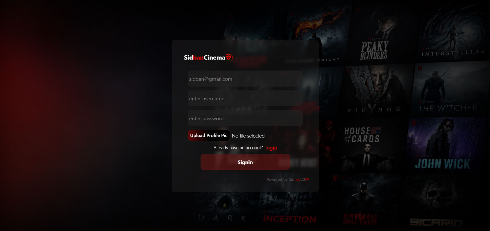

---

## 🔑 Login Page
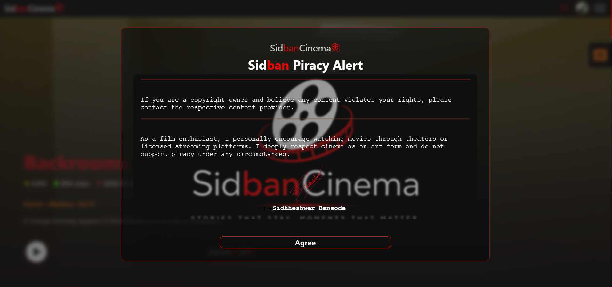

---

## 🛡️ Sidban Alert


---

## 🏠 Home Page
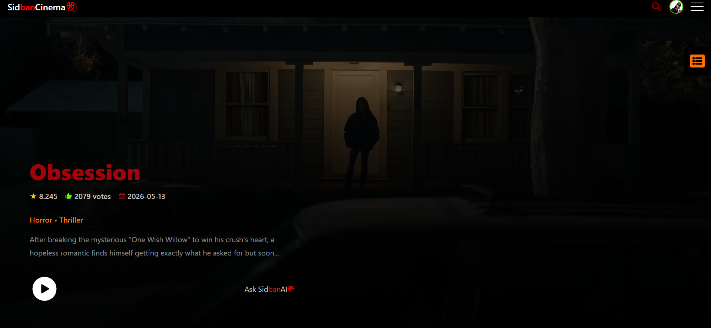

---

## 🎬 Header


---

## 🧭 Navigation Bar
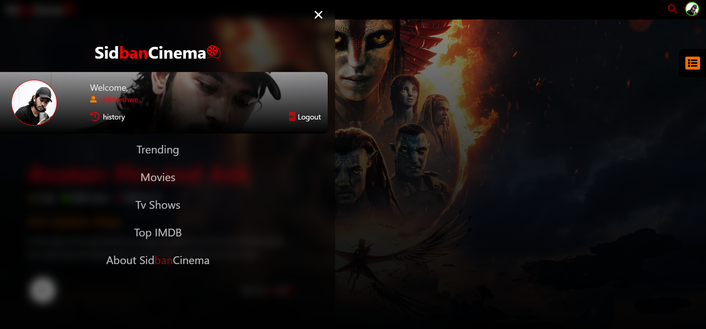

---

## 🎭 Categories Section
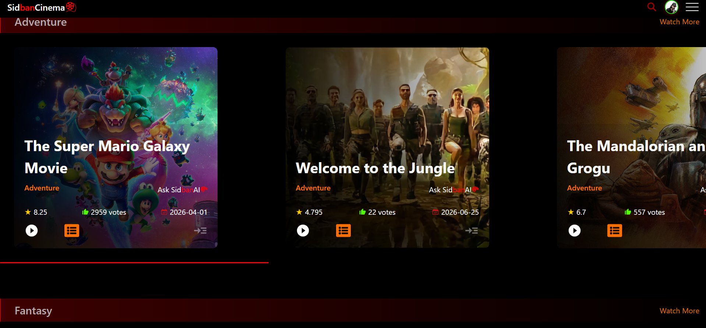

---

## 📂 Category Page
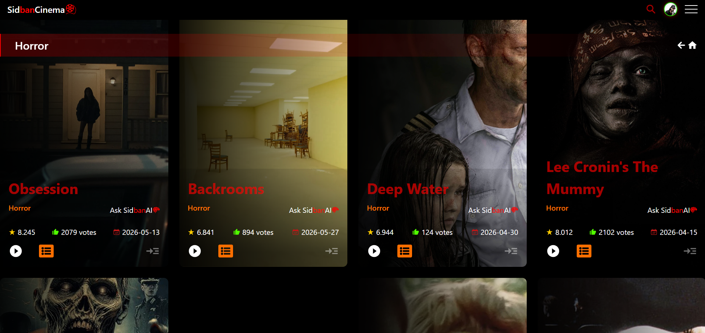

---

## 🕒 Watch History
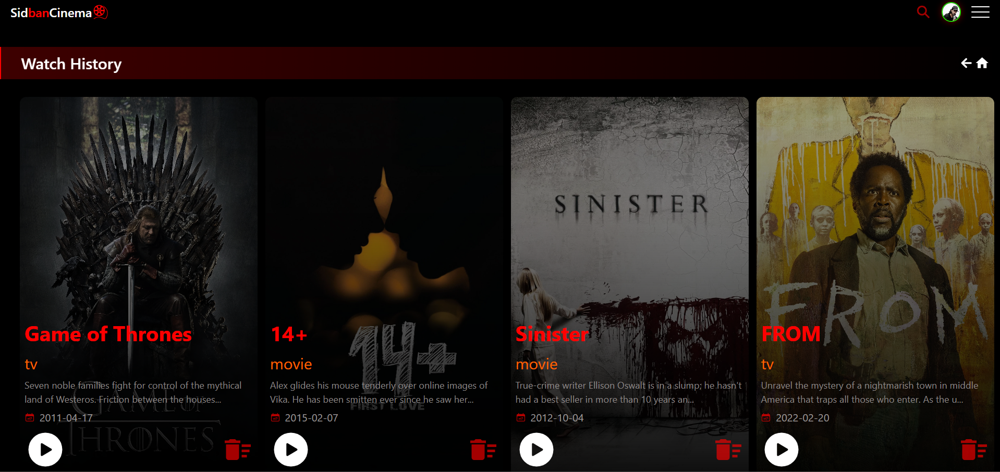

---

## 🤖 SidbanAI
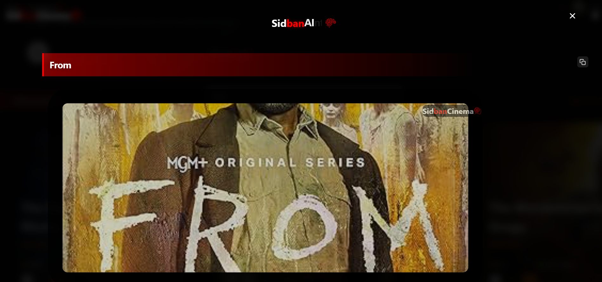

---

## 📖 Movie Overview
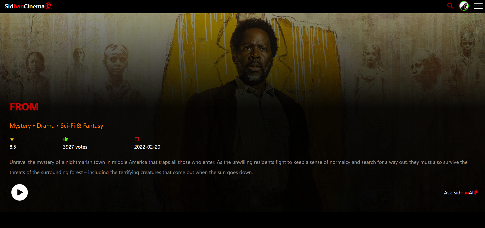

---

## 🎭 Cast & Crew
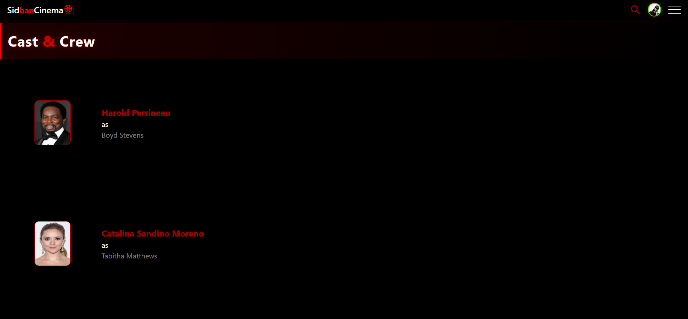

---

## 🔍 Search
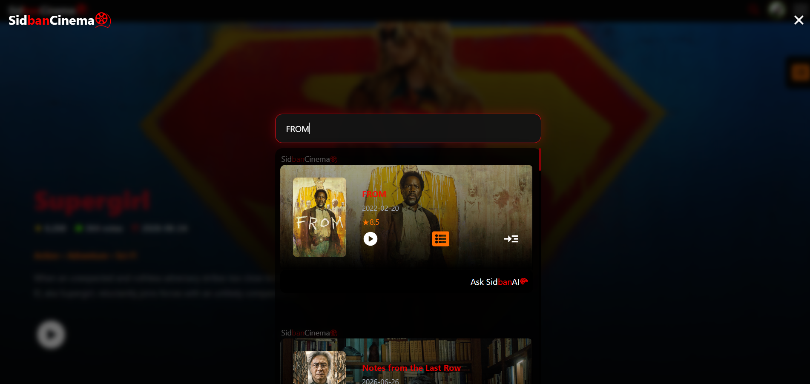

---

## ▶️ Movie Player


---

## 🎞️ Player Controls
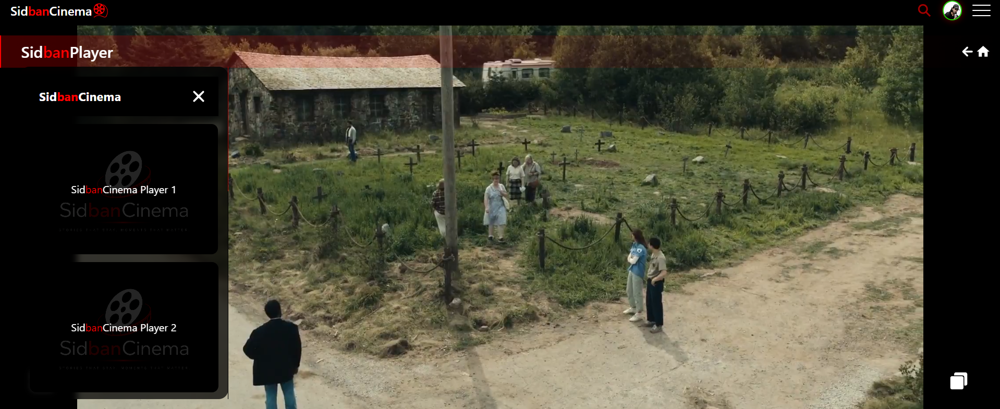

---

## 📺 Episodes Section
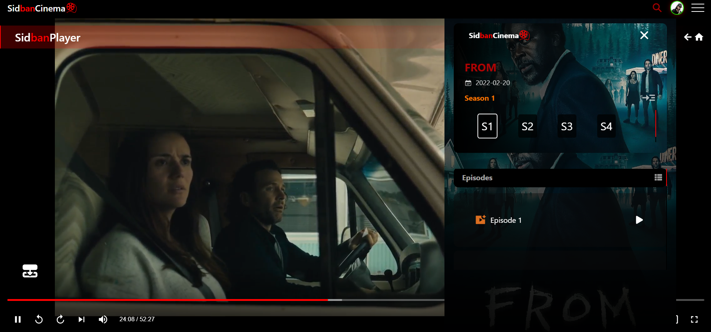

---

## ❌ Error Page
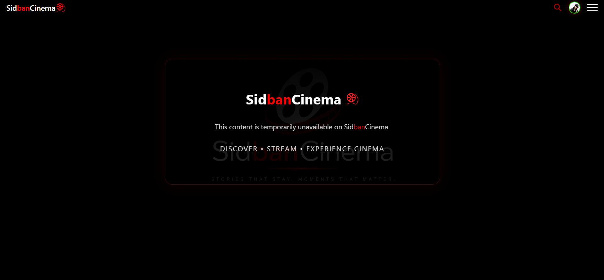

---

## ℹ️ About Page
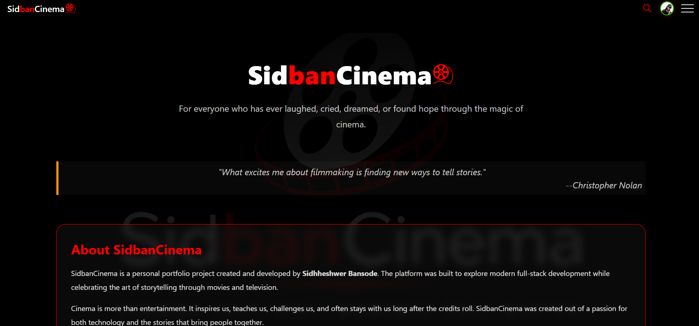

---

## ⏳ Sidban Loader
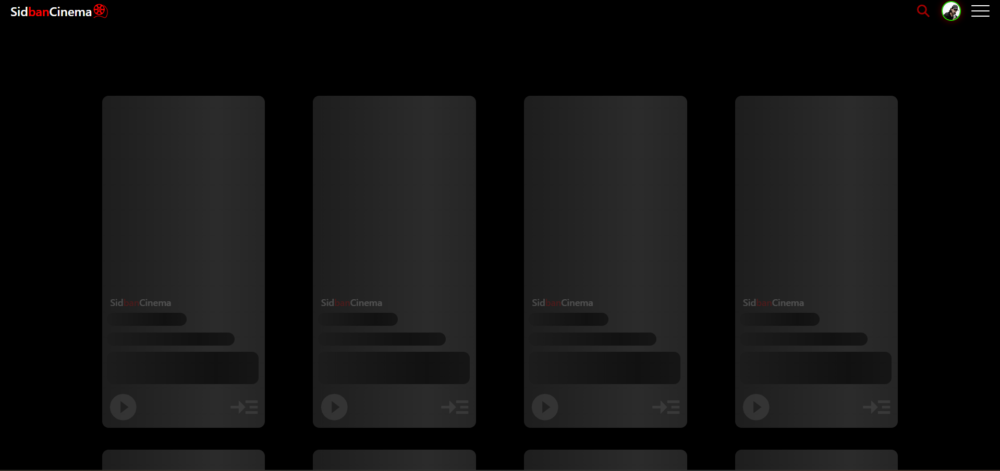

---

## 📄 Footer


# 🔒 Authentication

- JWT Authentication
- HTTP-Only Cookies
- Secure Login
- Protected Routes

---

# 🤖 SidbanAI

SidbanAI helps users discover movies,answer movie-related Summarys,and improve the browsing experience through AI-powered assistance.

---

# ⚡ Performance Optimizations

- Backend API Caching
- Infinite Scrolling
- Lazy Loading
- Optimized REST APIs
- Responsive UI
- Cloudinary Image Optimization

---

# ⚠ Disclaimer

SidbanCinema is an educational and portfolio project created to demonstrate full-stack development skills.

This project:

- Does **not** host or distribute copyrighted media.
- Does **not** store movies on its own servers.
- Uses publicly available third-party APIs and services.
- All movie posters, metadata, and related content belong to their respective copyright owners.

I strongly encourage supporting the film industry by watching movies in **theaters** or through **official licensed streaming platforms**.

---

# 👨‍💻 Developer

## Sidhheshwer Bansode

> "Dreams are the silent promises we make to ourselves."

---

⭐ If you enjoyed this project, consider giving it a Star.